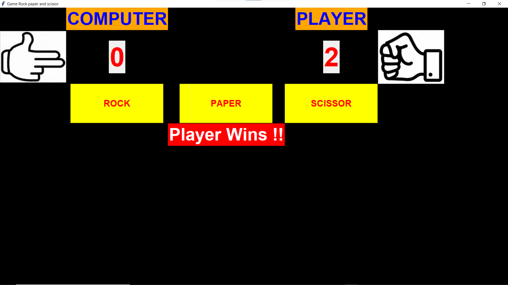

# Rock-Paper-Scissor-App
In these project, I created a "Rock Paper Scissors" game as GUI application using python Tkinter library.

•Made for two players,

•By default, computer is second player,

•highly interactive and accurate.

***Game GUI**

*For accessing the web app you need to run the cmd command in the file location by writing python Main.py,

For better understanding you can watch web app video on my LinkedIn profile- https://www.linkedin.com/in/rajiljain
